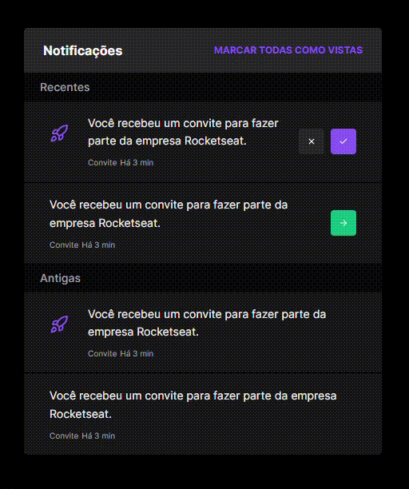

# Widget Notification

Um widget criado utilizando Next JS, tailwindcss, tailwind-merge e pattern de composição.


## Instalação

Basta clonar este repositório e comece a utilizar

```bash
  git clone https://github.com/cmoraes5/CompositionPattern
  cd ./CompositionPattern/widget-notifications
```
    
## Demonstração

Try this markdown:




## Começando

Primeiro, rode o ambiente de servidor

```bash
npm run dev

# ou
yarn dev

# ou
pnpm dev
```

Abra em http://localhost:3000 com seu navegador para ver o resultado.

O projeto usa next/font para otimizar e carregar automaticamente a font Inter, da Google.
## Leia mais sobre

Para aprender mais sobre Next.js e tailwindcss, dê uma olhada nos links abaixo:

- [Documentação do Next.js](https://nextjs.org/docs) - aprenda sobre Next.js features e API's.
- [Pattern de composição](https://dev.to/thomas_hoadley/software-patterns-composition-vs-inheritance-2fi1) - entenda mais sobre a diferença entre os patterns de Herança e Composição.
- [Documentação do TailwindCSS](https://tailwindcss.com/docs/installation) - saiba mais sobre o tailwindcss e como ele funciona.
## Apêndice

O projeto contém um tema dinâmico que é alterado bastando mudar o tema do seu Sistema Operacional ou navegador de claro para escuro ou vice-versa


## Referência

 - [Video da Rocketseat sobre o Patterns de Composição](https://www.youtube.com/watch?v=oPOKpSFqy-I)
 - [Video da Rocketseat criando um widget notification](https://www.youtube.com/watch?v=4qpgwR6JZPY)

